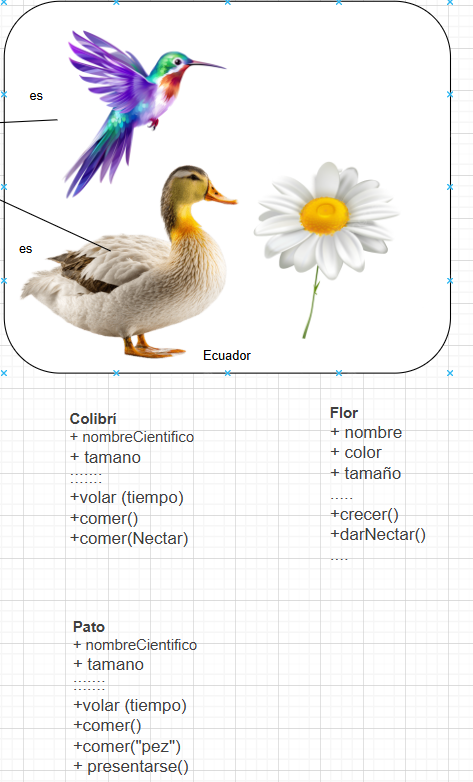
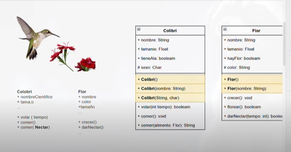

## Resumen explicativo del tema UML y POO (lo que vimos en clase)

En la clase el profe parte de una idea sencilla: **no es lo mismo programar con funciones sueltas que pensar en objetos**.  
Para eso va construyendo el tema en varios pasos.

---

### 1. De programación estructurada a programación orientada a objetos

Primero compara dos estilos:

- **Programación estructurada**  
  - Se trabaja con procedimientos y funciones `void` o que retornan un tipo de dato.  
  - Se usan variables globales y locales, `struct`, librerías, eventos, etc.  
  - Todo gira alrededor del código que se ejecuta paso a paso.

- **Programación orientada a objetos (POO)**  
  - Ahora el centro ya no son solo las funciones, sino las **clases**, **objetos**, **atributos** y **métodos**.  
  - Aparecen conceptos como:
    - clases y objetos  
    - encapsulamiento y abstracción  
    - generalización / especialización  
    - eventos y mensajes entre objetos  
    - librerías y paquetes

También introduce el **ámbito** (visibilidad) usando la notación UML:

- `+` público  
- `-` privado  
- `#` protegido  

Esto se ve luego tanto en los diagramas como en el código Java.

---

### 2. Reptil: ejemplo para entender objeto, atributos y métodos

Para aterrizar las ideas de POO, muestra la imagen de un **reptil**:

- A la derecha aparece una tabla con:
  - **Características**: nombre, tamaño, color…  
  - **Acciones**: comer, correr, reproducirse…

Con esto se entiende que:

- Un **objeto** (el reptil real) tiene **datos** y **comportamientos**.
- En código, esos datos se convierten en **atributos** y las acciones en **métodos** dentro de una **clase `Reptil`**.

Este mismo esquema se repite luego con otros ejemplos (colibrí, flor).

---

### 3. UML: qué es y para qué sirve

Después entra a **UML (Unified Modeling Language)**:

- Explica que UML es un **lenguaje de modelado visual** que permite dibujar:
  - la estructura del sistema (clases, atributos, métodos y relaciones),
  - y su comportamiento (cómo interactúan los objetos, qué mensajes se envían, qué estados tienen, etc.).

Menciona dos grandes grupos de diagramas:

- **Diagramas estructurales (estáticos)**  
  - Diagrama de clases  
  - Diagrama de objetos  
  - Diagrama de componentes  
  - Diagrama de despliegue, etc.

- **Diagramas de comportamiento (dinámicos)**  
  - Casos de uso  
  - Secuencia  
  - Actividades  
  - Máquinas de estado  
  - Comunicación / interacción, etc.

Para la clase, se centra sobre todo en el **diagrama de clases**, porque es el que se usa para diseñar las clases que luego se programan en Java.

---

### 4. Modelo del ecosistema “Ecuador”: Colibrí, Flor y Controller

Luego arma un ejemplo más completo: un **ecosistema en Ecuador**.  
En el diagrama aparecen:

- Una imagen de un **colibrí** y una **flor** (lado izquierdo).
- Un **diagrama de clases UML** (lado derecho) con:
  - Clase `Colibri`
  - Clase `Flor`
  - Clase `Controller`

#### 4.1. Clase `Colibri` en UML

En el recuadro de `Colibri` se ven:

- **Atributos**:
  - `+ nombre : String`
  - `+ tamano : Float`
  - `+ tieneAla : Boolean`
  - `# sexo : char`
- **Constructores**:
  - `+ Colibri()`
  - `+ Colibri(nombre : String)`
  - `+ Colibri(nombre : String, sexo : char)`
- **Métodos**:
  - `+ volar(tiempo : int) : boolean`
  - `+ comer() : void`
  - `+ comer(flor : Flor) : String`

Con esto no solo se ve qué datos tiene el colibrí, sino qué acciones puede realizar y con qué parámetros.

#### 4.2. Clase `Flor` en UML

La clase `Flor` tiene una estructura similar:

- **Atributos**:
  - `+ nombre : String`
  - `+ tamano : Float`
  - `+ hayFlor : Boolean`
  - `# color : String`
- **Constructores**:
  - `+ Flor()`
  - `+ Flor(nombre : String)`
  - `+ Flor(nombre : String, color : String)`
- **Métodos**:
  - `+ crecer() : void`
  - `+ florear(tiempo : int) : boolean`
  - `+ darNectar(tiempo : int) : boolean`

En el diagrama también se ve la relación entre `Colibri` y `Flor`, indicando que el colibrí puede interactuar con una flor (por ejemplo, comer de ella).

#### 4.3. Clase `Controller` en UML

Finalmente aparece la clase `Controller`:

- Atributo:
  - `+ temperaturaGrado : Integer`
- Método:
  - `+ iniciar() : void`

Esta clase actúa como “director” del ecosistema: crea colibríes y flores y hace que interactúen.

---

### 5. Del diagrama UML al código Java

En la parte final, el profe abre **VS Code** y muestra cómo el diagrama se convierte en código:

- Cada recuadro del UML se transforma en una **clase Java** (`Colibri.java`, `Flor.java`, `Controller.java`, `App.java`).
- Los **atributos** del diagrama se vuelven **variables de instancia**.
- Los **constructores** se escriben en Java igual que en el UML, incluso con sobrecarga (mismo nombre, distintos parámetros).
- Los **métodos** se programan con la lógica correspondiente, usando `System.out.println` para mostrar mensajes como:
  - “El colibrí X está volando”
  - “La flor Y está floreando”
  - “La flor Y está dando néctar”
- En `Controller.java`, el método `iniciar()` crea objetos de `Flor` y `Colibri` y llama a sus métodos en cierto orden, mostrando cómo colaboran los objetos.
- Finalmente, en `App.java` está el `main`, que sirve como entrada al programa y desde donde se podría llamar a `Controller` para ejecutar todo el escenario.

---

### 6. Idea clave que queda de la clase

La clase completa muestra una secuencia clara:

1. Recordar la **programación estructurada**.  
2. Pasar a la **POO**, pensando en objetos con atributos y métodos (como el reptil).  
3. Usar **UML** para dibujar esas clases y sus relaciones (colibrí, flor, controller).  
4. Traducir ese diseño UML a **código Java real** en VS Code.

El mensaje final es que UML es una herramienta para **pensar y diseñar** el sistema antes de programar, y que la programación orientada a objetos permite representar mejor situaciones del mundo real dentro del código.

